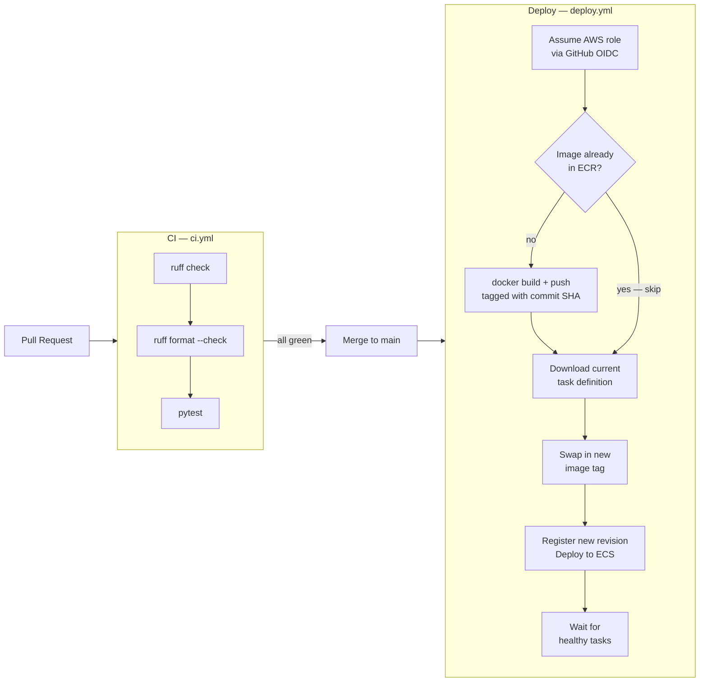

# datagovuk-sandbox


A Flask prototyping app for data.gov.uk ideas. Anything merged to `main` is automatically tested and deployed to AWS ECS Fargate.

**Live:** `http://test-datagovuk-sandbox-143318717.eu-west-2.elb.amazonaws.com`

---

## CI / CD pipeline



---

## Running locally

> [!IMPORTANT]
> Everything runs through Docker. Do not run `uv sync`, `uv add`, or `flask` directly on your machine — use the `just` commands below.

### Prerequisites

| Tool | Install |
|---|---|
| Docker Desktop | [docs.docker.com](https://docs.docker.com/get-docker/) |
| `just` | `brew install just` |

### Quickstart

```bash
git clone https://github.com/alphagov/datagovuk-sandbox
cd datagovuk-sandbox
cp example.flaskenv .flaskenv
just serve
```

App available at: `http://localhost:5050`

### Commands

| Command | What it does |
|---|---|
| `just serve` | Build the image and start the full stack |
| `just shell` | Open a bash shell in the running web container |
| `just add <package>` | Add a Python package via `uv add` (stack must be running) |

---

## Contributing

`main` is protected — no direct pushes.

1. Branch: `git checkout -b feature/DGUK-XXX-short-description`
2. Make your changes
3. Push and open a PR
4. CI must pass before merge

---

## CI checks

The CI workflow (`.github/workflows/ci.yml`) runs on every PR and every push to `main`:

| Check | Command | What it catches |
|---|---|---|
| Lint | `ruff check .` | Code errors and style violations |
| Format | `ruff format --check .` | Inconsistent formatting |
| Tests | `pytest tests/ -v` | Regressions |

Run locally before pushing:

```bash
uv run ruff check .
uv run ruff format --check .
uv run pytest tests/ -v
```

---

## Deployment

The deploy workflow (`.github/workflows/deploy.yml`) runs automatically on every merge to `main`:

1. Authenticates to AWS using GitHub OIDC — no credentials stored in GitHub Secrets
2. Checks if the image for this commit SHA already exists in ECR — skips build if it does (ECR tags are immutable)
3. Builds and pushes the Docker image tagged with the git commit SHA
4. Downloads the current ECS task definition, swaps in the new image tag
5. Registers the updated task definition as a new revision
6. Tells ECS to deploy and waits for healthy tasks before finishing

### AWS resources

| Resource | Value |
|---|---|
| AWS account | `gds-ndl-test` — `525320085442` |
| Region | `eu-west-2` (London) |
| ECS cluster | `test` |
| ECS service | `datagovuk-sandbox` |
| ECR registry | `525320085442.dkr.ecr.eu-west-2.amazonaws.com/datagovuk-sandbox` |
| ALB endpoint | `http://test-datagovuk-sandbox-143318717.eu-west-2.elb.amazonaws.com` |
| RDS (PostgreSQL 16) | `test-postgres.clwmgus4m1tq.eu-west-2.rds.amazonaws.com:5432` |
| Container logs | CloudWatch — `/ecs/test/datagovuk-sandbox` |

The app runs in a private subnet behind an Application Load Balancer. It connects to RDS using IAM authentication — no hardcoded passwords. `SECRET_KEY` is generated by Terraform and injected as an environment variable. All infrastructure is managed in the [`datagovuk-infrastructure`](https://github.com/alphagov/datagovuk-infrastructure) repo.

---

## Adding a visualisation

All current charts are file-based — no database required.

```
data/<slug>.json    <- chart config (title, CSV file, column mapping, Highcharts options)
data/<slug>.csv     <- the data
```

The view at `/visualisations/<slug>` auto-discovers every `data/*.json` file. Adding a new chart is:

1. Drop your CSV into `data/`
2. Copy `data/visualisation.json.template` to `data/<slug>.json`
3. Fill in the column names and Highcharts config
4. Push to `main` — the deploy pipeline does the rest

See [`data/README.md`](data/README.md) for the full field reference and examples.

---

## Site checks for data.gov.uk

Scripts in `scripts/` verify URLs on data.gov.uk collection pages using Playwright. They run automatically every day at 6am via `.github/workflows/check-collection-urls.yml` and commit results back to the repo.

To trigger a manual run, use the Actions tab in GitHub.

### Running locally

```bash
# Pull collection URLs from the datagovuk_find repo
uv run python -m scripts.cli get-collection-urls

# Check each URL is reachable and on the correct page
uv run python -m scripts.cli check-urls

# Flag URLs with missing link text
uv run python -m scripts.cli check-link-text
```

### Results CSV columns

Results land in `testing/results/collection-check-<timestamp>.csv`:

| Column | Description |
|---|---|
| `collection` | Collection name (e.g. `environment`) |
| `slug` | URL path segment on data.gov.uk |
| `url` | The URL being checked |
| `link-text` | Display text for the link |
| `type` | `website`, `api`, or `dataset` |
| `on-page` | Whether the URL appeared as a link on the collection page |
| `reachable` | Whether the URL loaded successfully in the browser |
